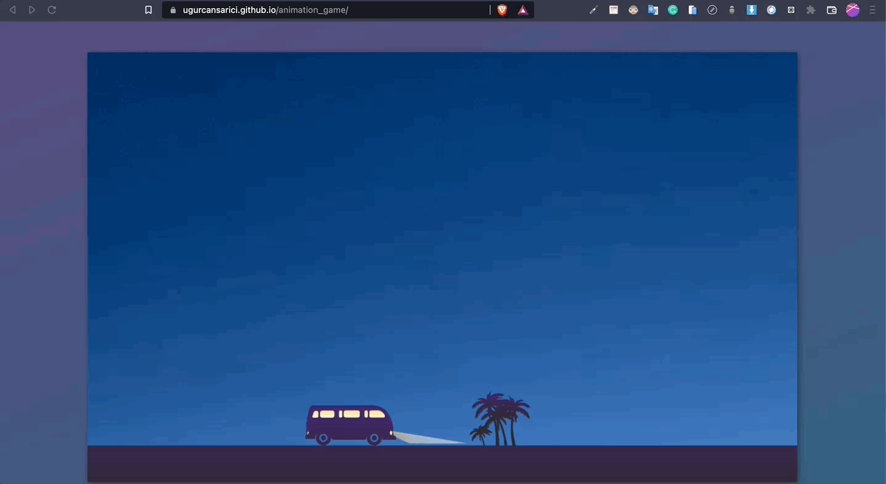

# Project : Car Animation

## Table of contents

  - [The challenge](#the-challenge)
  - [Screenshot](#screenshot)
  - [Project Skeleton ](#project-skeleton)
  - [Links](#links)
  - [Built with](#built-with)
  - [Useful resources](#useful-resources)


## The challenge
To create a moving car animation with lamp


## Project Skeleton 

```
HTML-CSS-JS-Animation_game(folder)

|----README.md                   
|----index.html
|----style.css
|----app.js


```

## Screenshot
<p align="center">
<a href="https://github.com/UgurcanSARICI/HTML-CSS-JS-Animation_game"></a>
</p>


## Links
<hr>
<b>Check The Live Website ➡️</b> <a href="https://ugurcansarici.github.io/HTML-CSS-JS-Animation_game/">Live Website</a>
<hr>

### Built with
- CSS Animation
- JS DOM Manipulation
- Semantic HTML5 markup
- CSS custom properties
- Flexbox
- CSS Grid
- Mobile-first workflow
	
- HTML Forms-Input Types 

- HTML Form Elements

- CSS Colors-Border Properties

- CSS Margins-Padding

- CSS Properties for Texts-Font Families-Links


## Notes

- You can use HTML,and CSS, JS to complete this project.

### Useful resources

- [W3 Schools](https://www.w3schools.com/) 
- [MDN](https://developer.mozilla.org/en-US/) 


<center> &#8987; Happy Coding  &#9997; </center>
